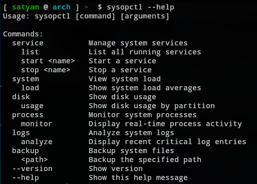
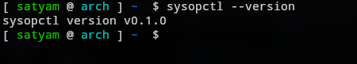
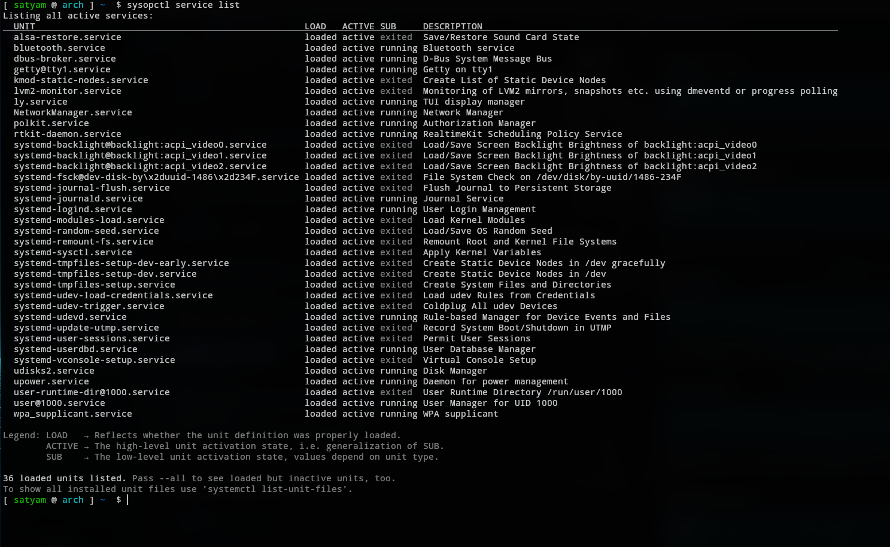
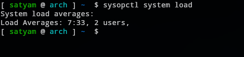
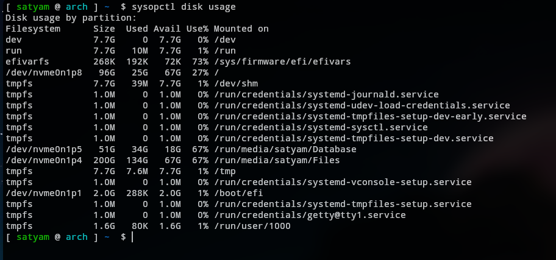
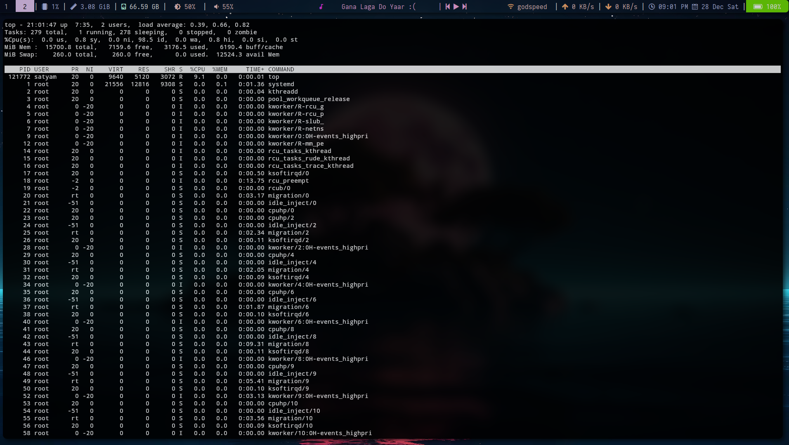
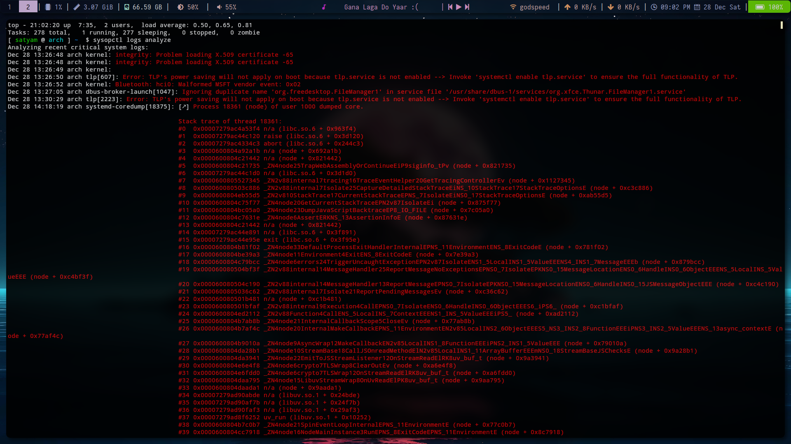

# **sysopctl Command Overview**
The `sysopctl` command is a custom Linux tool designed for system administration. It provides a suite of operations to manage system services, processes, disk usage, system load, logs, and backups. The command can be invoked with different options and parameters to execute various administrative tasks on a Linux machine. Below is a structured solution for the task, including the basic functionality and the advanced features.

This script, `sysopctl`, is a command-line tool for managing system tasks. It supports commands like:

- `service` (manage system services)
- `system load` (display system load)
- `disk usage` (show disk usage)
- `process monitor` (monitor system processes)
- `logs analyze` (view critical logs)
- `backup` (backup files)

The script processes user input, executing relevant functions using commands like `systemctl`, `df`, `top`, `journalctl`, and `rsync`. The `--help` and `--version` options provide usage info.

---

##### Help Option (`--help`)

```bash

sysopctl --help

```

The `--help` option will show users the usage, available commands, and examples.



---

##### Version Information (`--version`)

```bash

sysopctl --version

```

To provide the version information:



---

##### View Service list

```bash

sysopctl service list

```

Expected Output: List of all active services, similar to systemctl list-units --
type=service.




---


##### View System Load:

```bash

sysopctl system load

```

Expected Output: Current system load averages, akin to the output from the
uptime command.




---


##### Manage System Services:

```bash

sysopctl service start <service-name>

sysopctl service stop <service-name>

```

Expected Output: Status updates confirming the start or stop of services,
similar to systemctl start/stop.


---

##### Check Disk Usage:

```bash

sysopctl disk usage

```

Expected Output: Disk usage statistics by partition, similar to df -h.




---

##### Monitor System Processes:

```bash

sysopctl process monitor

```

Expected Output: Real-time process activity, akin to top or htop.




---


##### Analyze System Logs:

```bash

sysopctl logs analyze

```

Expected Output: Summary of recent critical log entries, utilizing tools like `journalctl`.




---

##### Backup System Files:

```bash

sysopctl backup <path>

```

Expected Output: Confirmation of backup initiation and status, potentially
using rsync for file transfers.